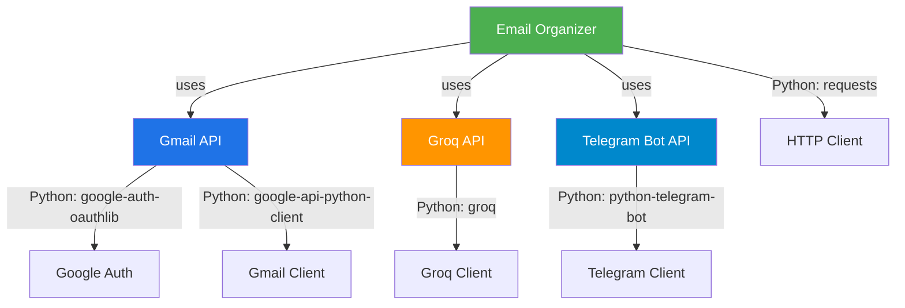
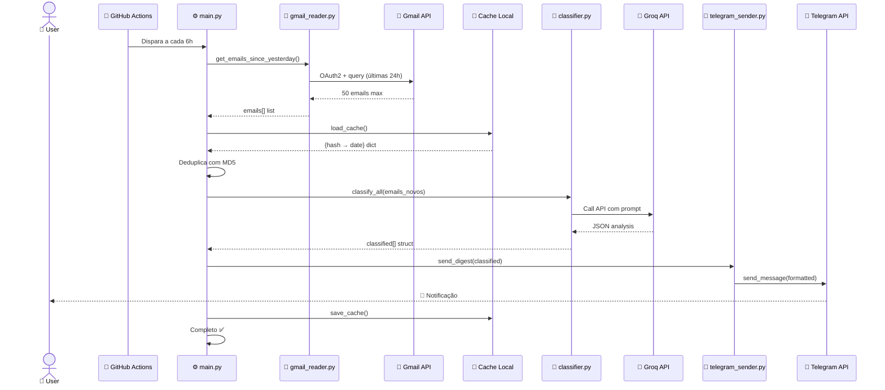
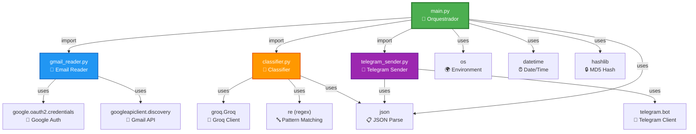

# 📐 Arquitetura Visual do Email Organizer

Diagramas visuais e estruturação do projeto.

## 1. Arquitetura em Camadas

```
┌─────────────────────────────────────────────────┐
│           CAMADA DE APRESENTAÇÃO                │
│         📱 Telegram (usuário final)             │
└─────────────────────────────────────────────────┘
                        ↑
                        │ send_digest()
                        ↓
┌─────────────────────────────────────────────────┐
│        CAMADA DE FORMATAÇÃO                     │
│    telegram_sender.py (formata + envia)         │
└─────────────────────────────────────────────────┘
                        ↑
                        │ classified[]
                        ↓
┌─────────────────────────────────────────────────┐
│        CAMADA DE LÓGICA/NEGÓCIO                 │
│   main.py (orquestra todo o fluxo)              │
│   - Deduplicação                                │
│   - Cache management                            │
└─────────────────────────────────────────────────┘
                        ↑
                        │ emails_novos[]
                        ↓
┌─────────────────────────────────────────────────┐
│        CAMADA DE ANÁLISE (IA)                   │
│  classifier.py (categoriza + analisa)           │
│   - Keywords matching                           │
│   - Groq API calls                              │
└─────────────────────────────────────────────────┘
                        ↑
                        │ emails[]
                        ↓
┌─────────────────────────────────────────────────┐
│        CAMADA DE INTEGRAÇÃO                     │
│  gmail_reader.py (acessa APIs externas)         │
│   - Google OAuth2                               │
│   - Gmail API v1                                │
└─────────────────────────────────────────────────┘
                        ↑
                        │
                        ↓
┌─────────────────────────────────────────────────┐
│        SERVIÇOS EXTERNOS                        │
│   🔵 Gmail  |  🤖 Groq/Llama  |  📨 Telegram   │
└─────────────────────────────────────────────────┘
```

---

## 2. Fluxo de Dados (Mermaid)

```mermaid
graph LR
    A["🔵 Gmail API"] -->|get_emails| B["📧 Email Reader"]
    B -->|emails[]| C["🔄 Main Orchestrator"]
    C -->|cache check| D["💾 Cache Local"]
    C -->|emails_novos[]| E["🤖 Classifier"]
    E -->|call API| F["🧠 Groq/Llama"]
    F -->|classified[]| C
    C -->|send_digest| G["📱 Telegram Sender"]
    G -->|format + send| H["💬 Telegram Bot"]
    H -->|msg| I["👤 Usuário"]
    C -->|update| D
```

---

## 3. Estrutura de Arquivos

```
email-organizer/
│
├── 📁 .github/
│   └── 📁 workflows/
│       └── daily_digest.yml         # CI/CD - executa a cada 6h
│
├── 📁 src/                          # Código principal
│   ├── main.py                      # ⚙️ Orquestrador central
│   ├── gmail_reader.py              # 📧 Leitor de emails
│   ├── classifier.py                # 🤖 Classificador com IA
│   └── telegram_sender.py           # 📱 Enviador para Telegram
│
├── 📁 .venv/                        # Virtual environment (ignorado)
│
├── 📁 .vscode/                      # VS Code config (ignorado)
│
├── 🔐 credentials.json              # Google Cloud credentials (ignorado)
├── 🔐 token.json                    # OAuth2 token (ignorado)
├── 💾 processed_emails.json         # Cache local (gerado)
│
├── 🐍 auth_interactive.py           # Setup: gera token OAuth2
├── 📋 requirements.txt              # Dependências Python
├── 🙈 .gitignore                    # O que ignorar do git
│
├── 📖 README.md                     # Documentação principal
├── 🔄 HOW_IT_WORKS.md               # Como funciona (detalhado)
└── 📐 ARCHITECTURE.md               # Este arquivo

```

---

## 4. Estrutura de Dependências



---

## 5. Máquina de Estados - Processamento de Email

```mermaid
stateDiagram-v2
    [*] --> FetchGmail: main.py inicia
    
    FetchGmail --> LoadCache: Conexão OK
    LoadCache --> DeduplicateCheck: Cache carregado
    
    DeduplicateCheck --> CheckCache{Hash no cache?}
    CheckCache -->|Sim| SkipEmail: Email já processado
    CheckCache -->|Não| Classify: Email novo
    
    SkipEmail --> FetchGmail: Próximo email
    
    Classify --> CategoryMatch{Categoria<br/>por keywords?}
    CategoryMatch -->|Vagas| CallGroq: relevante
    CategoryMatch -->|Treinamento| CallGroq: relevante
    CategoryMatch -->|Outros| SendTelegram: baixa relevância
    CategoryMatch -->|Financeiro| CallGroq: relevante
    
    CallGroq --> GroqAnalysis{Relevância<br/>≥ threshold?}
    GroqAnalysis -->|Não| Discard: descarta
    GroqAnalysis -->|Sim| SendTelegram: envia
    
    SendTelegram --> UpdateCache: Email processado
    Discard --> UpdateCache
    
    UpdateCache --> FetchGmail: Próximo email
    FetchGmail --> [*]: Completo
```

---

## 6. Estrutura de Dados - JSON Classificado

```json
{
  "vagas": [
    {
      "subject": "Analista de Dados - Empresa XYZ",
      "sender": "recrutador@xyz.com",
      "snippet": "Estamos buscando...",
      "analise": {
        "categoria": "vagas",
        "status": "nova_vaga",
        "relevancia": 95,
        "cargo": "Analista de Dados Senior",
        "empresa": "Empresa XYZ",
        "senioridade": "pleno",
        "modalidade": "remoto",
        "local": "São Paulo",
        "salario": "R$ 8-12k",
        "techs_match": ["Python", "SQL", "Power BI"],
        "resumo": "Vaga remota para analista sênior...",
        "link": "https://careers.xyz.com/job/123"
      }
    }
  ],
  "treinamento": [],
  "workshops": [],
  "newsletters": [],
  "financeiro": [],
  "outros": []
}
```

---

## 7. Sequência de Execução - Diagrama Timeline



---

## 8. Componentes de Configuração

```
┌─────────────────────────────────────────────────┐
│         VARIÁVEIS DE AMBIENTE                   │
├─────────────────────────────────────────────────┤
│                                                 │
│  GMAIL (OAuth2):                                │
│  ├── GMAIL_TOKEN (JSON completo)                │
│  ├── GMAIL_CLIENT_ID                            │
│  ├── GMAIL_CLIENT_SECRET                        │
│  └── GMAIL_REFRESH_TOKEN                        │
│                                                 │
│  IA (Groq/Llama):                               │
│  ├── GROQ_API_KEY ✅ OBRIGATÓRIO                │
│  └── GROQ_MODEL (default: llama-3.1-8b-instant)│
│                                                 │
│  NOTIFICAÇÕES (Telegram):                       │
│  ├── TELEGRAM_TOKEN ✅ OBRIGATÓRIO              │
│  └── TELEGRAM_CHAT_ID ✅ OBRIGATÓRIO            │
│                                                 │
└─────────────────────────────────────────────────┘
```

---

## 9. Ciclo de Vida - Local vs CI/CD

### 🖥️ Execução Local

```
┌─────────────────────────┐
│  Terminal / CMD         │
├─────────────────────────┤
│ 1. .venv\Scripts\activate
│ 2. $env:GMAIL_TOKEN = '...'
│ 3. $env:GROQ_API_KEY = '...'
│ 4. $env:TELEGRAM_TOKEN = '...'
│ 5. python src/main.py
└─────────────────────────┘
         ↓
    ~20-30 segundos
         ↓
  📱 Telegram notifica
         ↓
    Cache atualizado
```

### ☁️ GitHub Actions (CI/CD)

```
┌──────────────────────────────────────┐
│  .github/workflows/daily_digest.yml   │
├──────────────────────────────────────┤
│  Trigger: schedule (0 */6 * * *)     │
│           ou workflow_dispatch        │
└──────────────────────────────────────┘
         ↓
┌──────────────────────────────────────┐
│  Ubuntu Runner                        │
│  1. Checkout repository               │
│  2. Setup Python 3.11                 │
│  3. pip install -r requirements.txt   │
│  4. Injeta secrets (env vars)         │
│  5. python src/main.py                │
└──────────────────────────────────────┘
         ↓
    ~20-30 segundos
         ↓
  📱 Telegram notifica
         ↓
    Logs visíveis em Actions
```

---

## 10. Mapa de Dependências Entre Módulos



---

## 11. Fluxo de Erros e Tratamento

```
Email → Processamento
   │
   ├─❌ GMAIL_TOKEN inválido
   │   └─ → ValueError + exit
   │
   ├─❌ Conexão Gmail falha
   │   └─ → network error → retry ou skip
   │
   ├─❌ Groq API quota excedida
   │   └─ → rate limit → cache previous result
   │
   ├─❌ Telegram token inválido
   │   └─ → print aviso + continua
   │
   ├─❌ Arquivo cache corrompido
   │   └─ → except → load cache vazio
   │
   └─✅ Sucesso
       └─ → atualiza cache + envia Telegram
```

---

## 12. Comparação: Antes vs Depois (Fluxo)

### ❌ Antes (Manual)

```
Todo dia você:
1. Abre Gmail na web
2. Filtra emails novos
3. Lê cada um manualmente
4. Copia informações
5. Agrupa por categoria
6. Envia resumo manualmente
   → 15-30 minutos
```

### ✅ Depois (Automático)

```
Cada 6 horas:
1. GitHub Actions dispara
2. Lê automaticamente do Gmail
3. Classifica com IA
4. Remove duplicatas
5. Formata com emojis
6. Envia ao Telegram
   → ~30 segundos (automático!)
```

---

## 13. Matriz de Compatibilidade

| Requisito | Status | Notas |
|-----------|--------|-------|
| Python | ✅ 3.11+ | Testado em 3.11 |
| Sistema Operacional | ✅ Windows/Mac/Linux | Via GitHub Actions ou local |
| Gmail | ✅ Obrigatório | OAuth2 integrado |
| Groq API | ✅ Obrigatório | Para classificação IA |
| Telegram | ✅ Obrigatório | Para notificações |
| Internet | ✅ Obrigatório | Para APIs |
| GitHub | ✅ Obrigatório | Para CI/CD automático |

---

## 14. Escalabilidade

```
ATUAL (v1):
  • 1 conta Gmail
  • 50 emails/execução max
  • 6h entre execuções
  • 1 chat Telegram
  • ~40 API calls/semana

POSSÍVEL (v2):
  • N contas Gmail
  • 500 emails/execução
  • Execução sob demanda
  • N chats Telegram
  • Integração com webhook
  • Dashboard web
  • Histórico em database
```

---

## 15. Segurança - Fluxo de Dados Sensíveis

```
┌──────────────────────────────────────────────┐
│  DADOS SENSÍVEIS (NUNCA commitados)          │
├──────────────────────────────────────────────┤
│                                              │
│  credentials.json ────→ .gitignore           │
│  (Google Cloud ID)                           │
│                                              │
│  token.json ──────────→ .gitignore           │
│  (OAuth2 tokens)                             │
│                                              │
│  processed_emails.json → .gitignore          │
│  (Cache com hashes)                          │
│                                              │
│  Environment Variables:                      │
│  ├─ GMAIL_TOKEN ──────→ GitHub Secrets       │
│  ├─ GROQ_API_KEY ─────→ GitHub Secrets       │
│  ├─ TELEGRAM_TOKEN ───→ GitHub Secrets       │
│  └─ TELEGRAM_CHAT_ID ─→ GitHub Secrets       │
│                                              │
│  .env ────────────────→ .gitignore           │
│  (Local development)                         │
│                                              │
└──────────────────────────────────────────────┘
```

